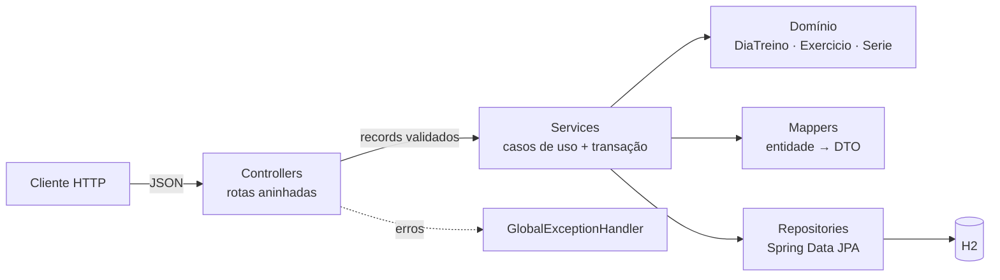

<p align="center">
  <picture>
    <source media="(prefers-color-scheme: dark)" srcset="branding/boost-trainer-logo-dark.svg">
    
  </picture>
</p>

<p align="center">
  <strong>API REST em Spring Boot para montar a semana de treino: dias, exercícios e séries com repetições e carga.</strong>
</p>

<p align="center">
  <a href="https://github.com/Tutzdev/BoostTrainer/actions/workflows/ci.yml"></a>
  
  
  
  
  
</p>

## Sobre

O domínio é uma hierarquia de três níveis, **dia de treino → exercícios → séries**. Parece simples, mas é o tipo de modelo que expõe rápido os problemas clássicos de JPA: agregado com invariantes, vínculo pai-filho, cascata, órfãos e consultas N+1. O projeto existe para resolver isso do jeito certo.

## Destaques de backend

- **Modelo de domínio rico:** entidades sem setters públicos. A numeração das séries e o vínculo pai-filho são regras da entidade (`Exercicio.adicionarSerie`), não dos services.
- **Sem N+1:** a semana inteira carrega com `JOIN FETCH` nos exercícios e `@BatchSize` nas séries, em poucas consultas fixas.
- **Agregado consistente:** `cascade = ALL` com `orphanRemoval`. Apagar um dia apaga exercícios e séries e não deixa registro órfão.
- **Contrato estável:** DTOs como `record` e mappers explícitos, então a entidade JPA nunca vaza pela API.
- **Erros previsíveis:** `@RestControllerAdvice` devolve 404 para recurso inexistente e 400 com a lista de erros por campo.
- **Transações bem delimitadas:** `@Transactional(readOnly = true)` nas leituras e escrita transacional nos casos de uso.

## Regras de negócio

| Regra | Onde fica |
| --- | --- |
| A série recebe o próximo número livre (maior existente + 1) e **nunca repete** número depois de uma exclusão | `Exercicio.adicionarSerie` |
| Série sempre pertence a um exercício, e exercício sempre pertence a um dia | `vincularAoExercicio` / `vincularAoDia` (visibilidade de pacote) |
| Carga é opcional (peso do corpo), repetições têm que ser positivas | Bean Validation nos `record` de entrada |
| Remover o dia remove toda a hierarquia | Mapeamento `cascade = ALL` + `orphanRemoval` |
| `equals`/`hashCode` estáveis entre estados transiente e persistido | Entidades (padrão recomendado para JPA) |

## Arquitetura



```text
api/src/main/java/com/treino/api/treino
├── controller/   # HTTP: rotas REST aninhadas (dia → exercício → série)
├── service/      # casos de uso e limites de transação
├── domain/       # entidades e invariantes do agregado
├── dto/          # contratos de entrada e saída (records + Bean Validation)
├── mapper/       # entidade → DTO, explícito e sem reflexão
├── repository/   # Spring Data JPA, consulta da semana com JOIN FETCH
└── exception/    # 404 e 400 padronizados
```

### API

| Método | Rota | Descrição |
| --- | --- | --- |
| `GET` | `/api/dias-treino` | Semana completa, com exercícios e séries |
| `GET` | `/api/dias-treino/{id}` | Um dia de treino |
| `POST` / `PUT` / `DELETE` | `/api/dias-treino[/{id}]` | Cria, edita e remove (em cascata) |
| `POST` | `/api/dias-treino/{id}/exercicios` | Adiciona exercício ao dia |
| `PUT` / `DELETE` | `/api/exercicios/{id}` | Edita e remove exercício |
| `POST` | `/api/exercicios/{id}/series` | Adiciona série (numerada pelo domínio) |
| `PUT` / `DELETE` | `/api/series/{id}` | Edita e remove série |

## Decisões técnicas

| Decisão | Por quê |
| --- | --- |
| Métodos com intenção no lugar de setters | `adicionarSerie` e `atualizarDados` concentram a regra num lugar só. O service orquestra, a entidade protege o próprio estado. |
| `JOIN FETCH` + `@BatchSize(30)` | Buscar dois níveis de coleção com `JOIN FETCH` gera produto cartesiano. O primeiro nível vem no join e o segundo em lote. |
| `getSeries()` devolve `List.copyOf` | Quem está de fora não altera a coleção sem passar pela regra do agregado. |
| Construtor `protected` sem argumentos | Atende o JPA sem permitir uma entidade inválida no código da aplicação. |
| Injeção por construtor | Dependências explícitas, classes fáceis de testar e sem `@Autowired` em campo. |
| H2 em memória com `create-drop` | O foco do projeto é o modelo e a API. O console H2 fica desligado por padrão (`H2_CONSOLE_ENABLED`). |

## Testes

```bash
cd api && ./mvnw test
```

- **Domínio (unitário):** numeração das séries em ordem, número que não se repete depois de uma remoção e vínculo série → exercício.
- **Integração (Spring + H2):** monta um treino completo e confere a hierarquia aninhada, remove o dia em cascata e recusa exercício em dia inexistente.
- **CI:** GitHub Actions roda `./mvnw verify` a cada push.

## Como rodar

Pré-requisito: **JDK 21**. Não precisa instalar banco.

```bash
cd api
./mvnw spring-boot:run          # http://localhost:8080
```

```bash
curl -X POST localhost:8080/api/dias-treino -H "Content-Type: application/json" \
     -d '{"dia":"SEGUNDA","nome":"Peito e tríceps"}'
```

## Interface

O repositório também tem um painel em React + TypeScript (`frontend/`) que consome essa API. Instruções em [`frontend/README.md`](frontend/README.md).

## Próximos passos

- Registrar **execuções** (data e carga real) para medir progresso ao longo do tempo.
- PostgreSQL + Flyway no lugar do H2.
- Autenticação com Spring Security para separar os treinos por usuário.
- Documentação OpenAPI gerada a partir dos controllers.

---

Desenvolvido por **[Tutzdev](https://github.com/Tutzdev)**.
