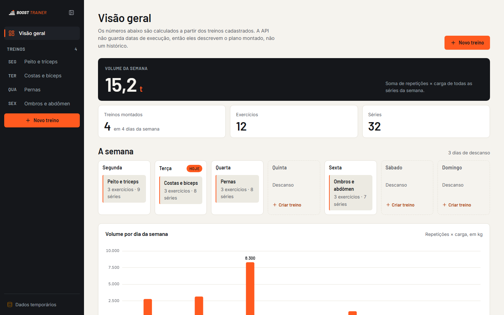
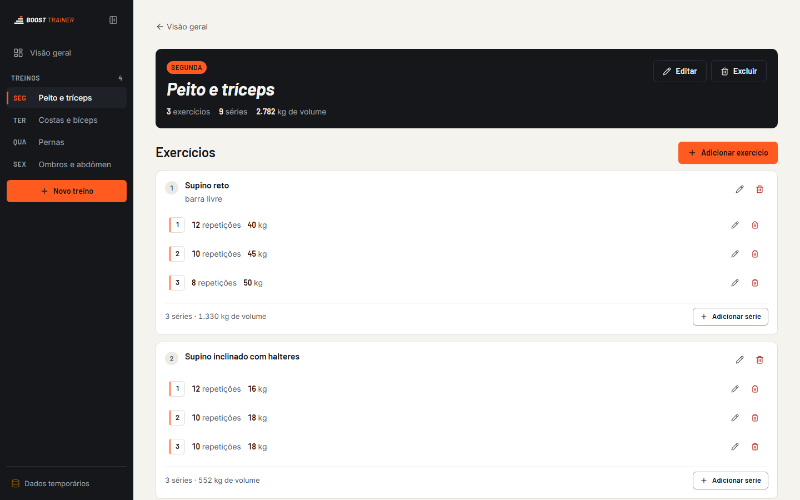
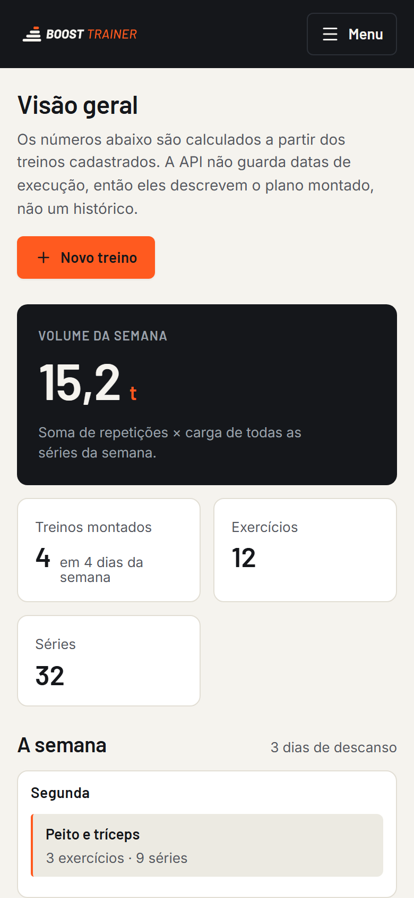
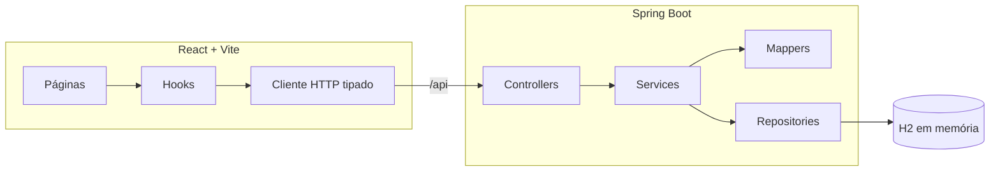

<p align="center">
  <picture>
    <source media="(prefers-color-scheme: dark)" srcset="branding/boost-trainer-logo-dark.svg">
    
  </picture>
</p>

<p align="center">
  <strong>Monte a semana de treino da academia: dias, exercícios e séries com repetições e carga, num painel que calcula o volume para você.</strong>
</p>

<p align="center">
  <a href="https://github.com/Tutzdev/BoostTrainer/actions/workflows/ci.yml"></a>
  
  
  
  
  
</p>



## Sobre

Fullstack com **API REST em Spring Boot** e **SPA em React + TypeScript**. O domínio é uma hierarquia de três níveis (**dia de treino → exercícios → séries**), o que exige cuidado com agregados, cascata e consultas N+1, mesmo num projeto de escopo pequeno.

| Detalhe do treino | No celular |
| --- | --- |
|  |  |

## Funcionalidades

- CRUD completo de **dias de treino, exercícios e séries** (repetições e carga).
- **Numeração automática das séries**, sem repetir número depois de uma exclusão.
- **Painel** com volume semanal (repetições × carga), totais, grade da semana com o dia atual e gráfico de volume por dia.
- Validação na API com mensagens por campo, exibidas no formulário certo.
- Interface responsiva, com estados de carregamento (skeleton), vazio, erro e confirmação antes de excluir.

## Arquitetura



```text
api/src/main/java/com/treino/api/treino
├── controller/   # HTTP: rotas REST aninhadas
├── service/      # regras e transações
├── domain/       # entidades e invariantes (DiaTreino, Exercicio, Serie)
├── dto/          # contratos de entrada e saída (records)
├── mapper/       # entidade → DTO, explícito
├── repository/   # Spring Data JPA
└── exception/    # erros padronizados da API

frontend/src
├── api/          # cliente tipado e classes de erro (nada de fetch nos componentes)
├── dominio/      # cálculo de volume e regras puras, testadas
├── hooks/        # leitura de recursos com cancelamento
├── componentes/  # layout, ui, painel e treino (CSS Modules)
└── paginas/      # Painel (/) e DetalheTreino (/treinos/:id)
```

### API

| Método | Rota | Descrição |
| --- | --- | --- |
| `GET` | `/api/dias-treino` | Semana completa, com exercícios e séries |
| `GET` | `/api/dias-treino/{id}` | Um dia de treino |
| `POST` / `PUT` / `DELETE` | `/api/dias-treino[/{id}]` | Cria, edita e remove (em cascata) |
| `POST` | `/api/dias-treino/{id}/exercicios` | Adiciona exercício ao dia |
| `PUT` / `DELETE` | `/api/exercicios/{id}` | Edita e remove exercício |
| `POST` | `/api/exercicios/{id}/series` | Adiciona série (numerada automaticamente) |
| `PUT` / `DELETE` | `/api/series/{id}` | Edita e remove série |

## Decisões técnicas

| Decisão | Por quê |
| --- | --- |
| Entidades sem setters públicos | Mudanças passam por métodos com intenção (`adicionarSerie`, `atualizarDados`). Assim a numeração e o vínculo pai-filho não ficam espalhados pelos services. |
| `JOIN FETCH` + `@BatchSize` | A semana inteira carrega em poucas consultas em vez de uma por exercício (evita N+1). |
| `cascade = ALL` + `orphanRemoval` | Apagar um dia apaga exercícios e séries, sem registros órfãos. |
| DTOs como `record` e mappers explícitos | O contrato da API não depende da entidade JPA e o mapeamento é fácil de ler. |
| Proxy do Vite em `/api` | Mesma origem no desenvolvimento, sem precisar de CORS na API. |
| Métricas calculadas no frontend | A API não guarda execuções, então o painel descreve o **plano montado**, e a tela deixa isso claro. |
| Só 2 dependências de runtime no front | `react-router-dom` e `lucide-react`. O resto é CSS Modules com design tokens. |

## Como rodar

Pré-requisitos: **JDK 21** e **Node.js 22+**. Não precisa de banco: a API usa H2 em memória.

```bash
# terminal 1: API em http://localhost:8080
cd api
./mvnw spring-boot:run

# terminal 2: frontend em http://localhost:5173
cd frontend
npm install
npm run dev
```

> Se a porta 8080 estiver ocupada, suba a API com `--server.port=8081` e crie `frontend/.env.local` com `BOOST_API_URL=http://localhost:8081`.
> O console do H2 fica desligado por padrão. Para depurar localmente, use `H2_CONSOLE_ENABLED=true`.

## Testes e qualidade

```bash
cd api && ./mvnw test              # domínio + fluxo completo com Spring e H2
cd frontend && npm run verificar   # oxlint + tsc + testes + build
```

- **Backend:** regras de numeração das séries e vínculo com o exercício, fluxo integrado dia → exercício → série, remoção em cascata e recurso inexistente.
- **Frontend:** cálculo de volume e totais (`node --test`), TypeScript estrito e lint.
- **CI:** backend e frontend rodam a cada push no GitHub Actions.

## Próximos passos

- Registrar **execuções** (data, carga real) para mostrar progresso ao longo do tempo.
- PostgreSQL + Flyway e autenticação para múltiplos usuários.
- Deploy do frontend na Vercel e da API em container.

---

Desenvolvido por **[Tutzdev](https://github.com/Tutzdev)**.
